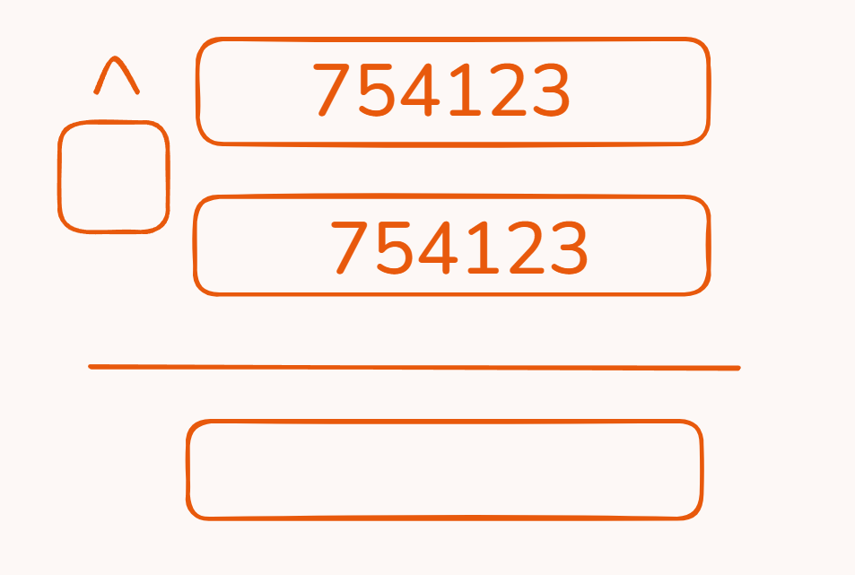

Act as a Senior Product Manager and Software Architect. I need your help to plan, structure, and design the technical and product workflow for an interactive, live-multiplayer educational platform.
Project Overview:
This platform will be used to host a Live Math Olympiad Event where multiple invited schools will compete. The platform requires real-time synchronization between a teacher/host device and multiple student devices.
CRITICAL REQUIREMENT: The entire front-end user interface, instructions, and user-facing content of this platform MUST be in Spanish.
Please review the following requirements and constraints, and then provide a comprehensive "Planning Phase Document" that includes: a proposed user flow/wireframe map, database schema considerations, necessary tech stack for real-time syncing, and edge cases to watch out for.
1. User Roles & Hardware Constraints:
Teacher (Host): Uses a single iPad as the "Host" device. This device controls the main index page, lobby, and session progression.
Students (Participants): Up to 20 student devices connected concurrently per live session.
2. Session Workflow & User Experience:
The Lobby: The Teacher creates a session. Students join this live session by entering a unique session code along with the name of their school.
Activity Bank & Assignment: The Teacher's account will have access to a bank of approximately 27 math activities. Initially, these are displayed as face-down "cards" so students cannot peek at the contents.
Distribution: The Teacher selects and assigns a subset of activities (typically 5 exercises per session) to the connected student devices. All 20 student devices will receive the exact same 5 assigned activities, remaining hidden as cards until the session begins.
Live Session: The Teacher presses "Start," which triggers a synchronized countdown timer on all student devices.
Progression Constraints: Once a student completes an exercise and moves forward, they are strictly prohibited from going back to a previous exercise.
Time Out: When the master timer finishes, all student devices are immediately locked out of the current exercise, preventing any further input.
3. Exercise Types & Functionality:
Type A: Standard Math Problem (4 out of 5 exercises)
Must include a multiple-choice selection.
Must include a section called "Procedure". This is an interactive template where students must input specific numbers into designated boxes and select the correct mathematical operation (e.g., +, -, x, ÷) to mimic showing their work.
Type B: Interactive Tangram (1 out of 5 exercises)
Students must drag geometric shapes into a specific silhouette (drop zone) to build a figure.
This specific exercise slot acts as a "loop." There is a mini-bank of tangram puzzles; every time a student successfully completes one tangram, a new one is immediately displayed until the session timer runs out.
4. Feedback, Scoring, and Analytics:
Student View Constraints: Students must never see the correct answers, nor will they see their final score or feedback on their devices at the end of the session.
Teacher Analytics (Host View): The Teacher dashboard must collect and display real-time/post-game analytics per student, including: answers submitted, total score, and time spent per individual exercise.
Scoring Logic:
Standard Math: Points are calculated based on two distinct data points: 1) Choosing the correct multiple-choice option, and 2) Inputting the correct data into the "Procedure" template.
Tangrams: The system must track the time spent building each figure, whether the dragged shapes fit the drop zone perfectly, and capture a record of the finished silhouettes. The student is awarded 1 point for each successfully completed tangram within the time limit.
Based on these details, please provide your structural plan, architecture recommendations, and step-by-step logic flow to make this Spanish-language Math Olympiad platform a reality.

{width="2.5182939632545933in"
height="1.6939293525809274in"}